# Turning Documents and Databases into Living Ontologies: Inside Arango-OntoExtract

*We built an open-source platform that uses LLMs to extract formal ontologies from your documents and your live database schemas — then versions them, revises them as new evidence arrives, and repairs them without a human. Here's the architecture, and the measurement that changed how we spend our engineering effort.*

**⭐ [github.com/arango-solutions/arango-ontoextract](https://github.com/arango-solutions/arango-ontoextract)** — MIT licensed. Everything in this article is in the repo, and there's a [runnable quick start](#try-it) at the end. No prior knowledge of ontologies or ArangoDB assumed; every term is defined as it appears.

<!--
  MAINTAINER NOTE — not part of the published article. Delete this block, or leave it:
  HTML comments don't render on Medium or GitHub either way.

  Draft v2. Concept figures are Mermaid diagrams (render natively on GitHub and most
  Markdown import tools); product figures are  SCREENSHOT PLACEHOLDERS —
  drop the PNGs into docs/images/ (capture checklist in docs/images/README.md). Each
  placeholder carries a hidden CAPTURE: comment saying what to grab. Delete any
  placeholders you don't use before publishing. Tuned for a 5–10 page read.

  Changes since v1: promotional lede + Try it CTA; a plain-language primer on the
  database layer (§3); a new §13 on curated names and the re-extraction bug that made
  them survivable; A-box canvas rendering; reverse time-travel playback.
-->

---

## 1. The problem: knowledge is trapped in prose and schemas

Every organization sits on two giant piles of latent structure.

The first pile is **documents** — PDFs, slide decks, Word files, wikis. They describe how a business actually thinks: its concepts, its taxonomies, its rules. But that knowledge is locked in prose and diagrams. You can search it; you can't *reason* over it.

The second pile is **databases** — the relational tables and graph collections that already encode a working model of the domain, but only *physically*. A `customers` table and a `places_order` foreign key imply concepts and relationships, yet nothing says "a Customer is a kind of Party" or "an Order must have at least one line item."

A **formal ontology** is the bridge between those piles and machine reasoning. If the word is new to you, the short version: an ontology is a machine-readable model of what exists in a domain and how it relates — the **classes** (Customer, Order, Loan Product), the **properties** that connect and describe them (an Order *has* line items; a Customer *has* a credit rating), the **hierarchy** (a Retail Mortgage is a kind of Loan Product), and the **constraints** (an Order must have at least one line item). Think of it as a database schema that carries meaning instead of just storage layout — one that software can traverse, validate against, and reason over. The standards for writing them down are called **OWL 2** and **RDFS**, and they're what most of the tooling in this space speaks.

The catch: authoring ontologies by hand is slow, expensive, and requires rare expertise. And once authored, they rot — the sources they were derived from keep changing, but the ontology doesn't.

**Arango-OntoExtract (AOE)** is our answer, and it's **open source under the MIT licence** — [github.com/arango-solutions/arango-ontoextract](https://github.com/arango-solutions/arango-ontoextract). It uses LLMs to *propose* ontologies — from unstructured documents and from live database schemas — then puts a domain expert in the loop to curate them, all on one multi-model database that holds the documents, the graph, the vectors, and the search index together. Everything described in this article is in that repository; there's a runnable quick start at the end.

The idea that shaped everything: an ontology isn't a build artifact you produce once. It's a **living knowledge graph** that gets revised, time-travelled, and self-repaired.


*The Arango-OntoExtract workspace — a single stage where documents become a curated, navigable ontology.*
<!-- CAPTURE: Hero shot. /workspace with a visually rich demo ontology loaded. Show explorer (left), Sigma.js graph (center, nicely laid out), VCR timeline (bottom). Wide/landscape ~1600px. Avocado-green theme. Redact any org/prospect names. -->

---

## 2. The core idea: a two-tier ontology library

The first design decision was refusing to treat every extracted ontology as an island. AOE organizes knowledge into **two tiers**:

- **Tier 1 — the Domain Ontology Library.** Standardized, reusable schemas extracted from industry-standard documents (ISO, W3C, NIST, and the like). Curated once, shared across organizations.
- **Tier 2 — Localized Ontologies.** Each organization's own concepts, which *extend* Tier 1 rather than copying it.

The critical property: Tier 2 is **structurally linked** to Tier 1 via standard OWL/RDFS constructs — `rdfs:subClassOf`, `owl:equivalentClass`, `owl:imports` — not forks or copies. A bank's "Retail Mortgage" is a subclass of the shared "Loan Product"; it inherits its semantics instead of redefining them.

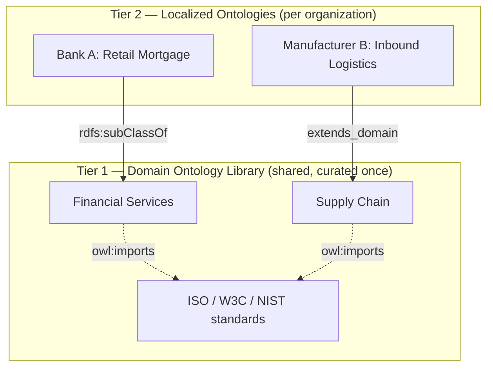

*Figure 1 — The two-tier model. Localized ontologies extend a shared domain library through standard OWL constructs, never copies.*


*Screenshot — the imports-dependency overlay: a localized ontology and the domain ontologies it extends, as real edges.*
<!-- CAPTURE: Workspace "Manage Imports" / imports-graph DAG overlay showing a composed ontology importing 1-2 others. Landscape. -->


This is what makes the library *compose* rather than sprawl. Cross-tier links are first-class edges in the graph, so "show me every local class that specializes this domain concept" is a one-hop traversal.

---

## 3. The system at a glance

AOE is three layers: a Next.js workspace, a Python/FastAPI backend with agentic orchestration, and a multi-model ArangoDB instance underneath. External AI agents can drive the whole thing through the **Model Context Protocol (MCP)** — the emerging standard for exposing an application's capabilities as tools an LLM agent can call, so a coding assistant or a chat agent can extract, query, and curate ontologies without a human touching the UI.

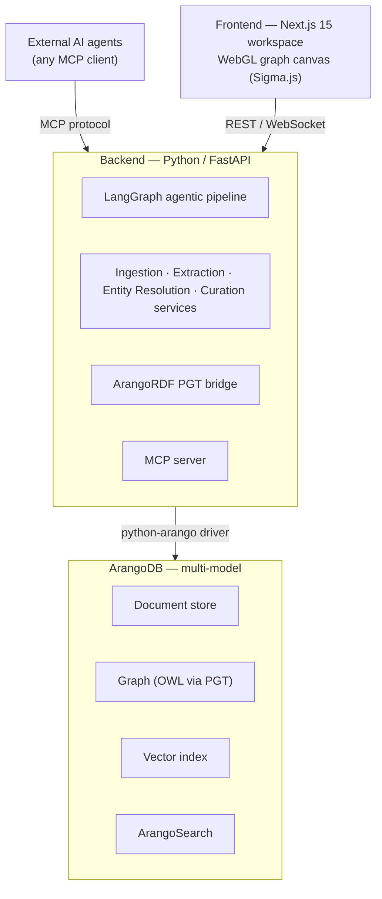

*Figure 2 — High-level architecture. One database engine holds documents, the OWL graph, vectors, and search; the backend orchestrates LLM agents; the frontend is a single persistent workspace.*

### A two-minute primer on the database layer

Almost everything that follows leans on one choice, so it's worth unpacking before we go further — especially if you've never used ArangoDB.

A system like this normally needs **four different kinds of storage** at once:

| What it stores | Why we need it here | The usual tool |
|---|---|---|
| **Documents** — JSON records | Uploaded files, text chunks, run metadata | MongoDB, Postgres JSONB |
| **A graph** — nodes and edges | The ontology itself: classes linked to classes | Neo4j |
| **Vectors** — embeddings | Semantic search over chunks; finding near-duplicate concepts | Pinecone, pgvector |
| **A search index** — full text | "Find every class mentioning *mortgage*" | Elasticsearch |

The conventional answer is to run three or four separate systems and write glue code to keep them in sync. That glue is where the bugs live: a concept exists in the graph store but its embedding never made it to the vector store; a document was deleted here but not there.

**ArangoDB is a *multi-model* database** — one engine that does all four natively, in one query language, in one transaction. That's the whole reason it's here. It means a single query can start from a document chunk, hop across the ontology graph, filter by a vector-similarity score, and rank by full-text relevance — without leaving the database or joining across systems. Its query language, **AQL**, is roughly "SQL that also knows how to walk a graph"; you'll see it referred to a few times below, and you don't need to read any.

Two more pieces of vocabulary, because ArangoDB names things slightly differently than you might expect: a **collection** is what other databases call a table (there are two flavours — *document* collections for nodes, *edge* collections for relationships), and a **named graph** is a declared bundle of those collections that the engine will traverse as a unit.

With that, the load-bearing choices in the diagram above:

- **One store instead of four.** Chunk embeddings, the ontology graph, and the full-text index live side by side. Provenance ("which slide produced this class?"), semantic retrieval, and graph traversal are all the *same* query engine. No syncing, no drift between systems.
- **ArangoRDF's PGT bridge.** Ontologies are written in OWL/RDFS, which is a *triple* format — everything is (subject, predicate, object). Property graphs are a different shape — nodes with attributes, edges with attributes. **Property Graph Transformation (PGT)** is the mapping between them: it imports OWL into ArangoDB while preserving the OWL structure (class hierarchy, which classes a property connects, cardinality restrictions), so the result is both a valid ontology *and* an ordinary, queryable graph. We get standards compliance without giving up graph performance.
- **LangGraph for orchestration.** Extraction isn't a single prompt; it's a stateful, multi-agent pipeline with retries, parallel branches, and a human-in-the-loop breakpoint — a compiled state machine, not a script.

---

## 4. The extraction pipeline: agents, not a prompt

The heart of AOE is a LangGraph `StateGraph` that turns document chunks into a reviewable ontology. It is deliberately *not* "send the document to an LLM and parse the JSON" — it's a sequence of specialized agents, each doing one job, with the graph handling retries, a parallel fork, and a curation pause.

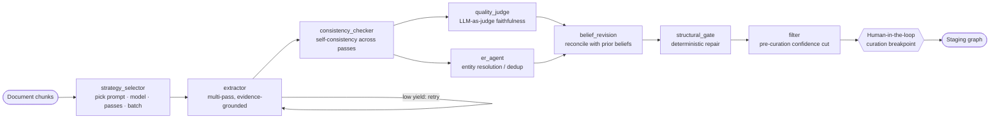

*Figure 3 — The LangGraph extraction pipeline. After consistency checking, quality judging and entity resolution run in parallel, then results are reconciled, structurally repaired, filtered, and paused for human curation before anything is staged.*


*Screenshot — the Pipeline Monitor running a real extraction: each agent's status plus live tokens, cost, confidence, and agreement.*
<!-- CAPTURE: Select a Run in the workspace → pipeline DAG canvas mid- or post-run. Show node statuses (done/running/skipped) and the metrics panel (tokens, cost, entities, confidence, completeness, agreement). Landscape ~1400px. -->


Walking the nodes:

1. **strategy_selector** classifies the document (technical, narrative, tabular, visual-heavy) and picks the prompt template, model, pass count, and batch size — a dense deck and a narrative spec shouldn't be extracted the same way.
2. **extractor** runs the LLM in multiple passes, emitting OWL constrained by a strict Pydantic schema. Every class, parent link, and relationship carries **evidence** — the source chunk IDs and quoted text that justify it — and if yield is suspiciously low, the graph loops back and retries.
3. **consistency_checker** keeps only concepts that appear across enough passes — a cheap, effective hallucination filter.
4. **quality_judge** and **er_agent** fork and run *in parallel*: one scores faithfulness with an LLM-as-judge, the other resolves duplicate entities via weighted similarity and union-find clustering.
5. **belief_revision**, **structural_gate**, and **filter** then reconcile the extraction against what the ontology already believes, apply deterministic evidence-anchored repairs, and drop low-confidence concepts — each detailed below.

The pipeline then **pauses** at a human-in-the-loop breakpoint: nothing reaches the curated ontology without a person — or an explicit policy — saying yes. That breakpoint is the philosophical center of the product: **the LLM proposes; the human disposes.**

---

## 5. From documents to a queryable graph

Before extraction can run, a document has to become chunks — and real documents are full of structure and pictures that naïve text extraction throws away.

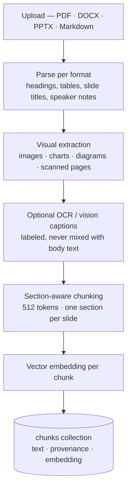

*Figure 4 — Ingestion and chunking. Visual evidence is inventoried (and optionally captioned) so taxonomies encoded in diagrams aren't lost; chunks preserve page/slide provenance.*


*Screenshot — a parsed deck's chunks with `[Visual: slide N]` markers and visual diagnostics: omitted evidence is visible, not silent.*
<!-- CAPTURE: A document's chunk/detail view (a PPTX works best) showing chunk text with a [Visual: slide N ...] marker and the per-doc visual diagnostics counts. -->


Two details matter more than they look:

- **Visual evidence is observable, not silent.** Domain decks often encode taxonomies and process flows in *diagrams*, not selectable text. AOE counts and represents every embedded image, chart, and scanned page — even when OCR/vision is off — so omitted evidence is *visible*, not quietly dropped. When configured, an OCR/vision-caption pass appends clearly-labeled context (`[Visual: slide 4 image 2] ...`) the extractor can cite as evidence.
- **Provenance is preserved from the first byte.** Each chunk links back to its document, page/slide number, and section heading — the chain that later lets a curator click a class and see the exact slide it came from.

Once the LLM produces OWL/Turtle from those chunks, AOE imports it into ArangoDB via ArangoRDF's PGT transformation and materializes a traversable graph — so ontology semantics become ordinary graph queries.

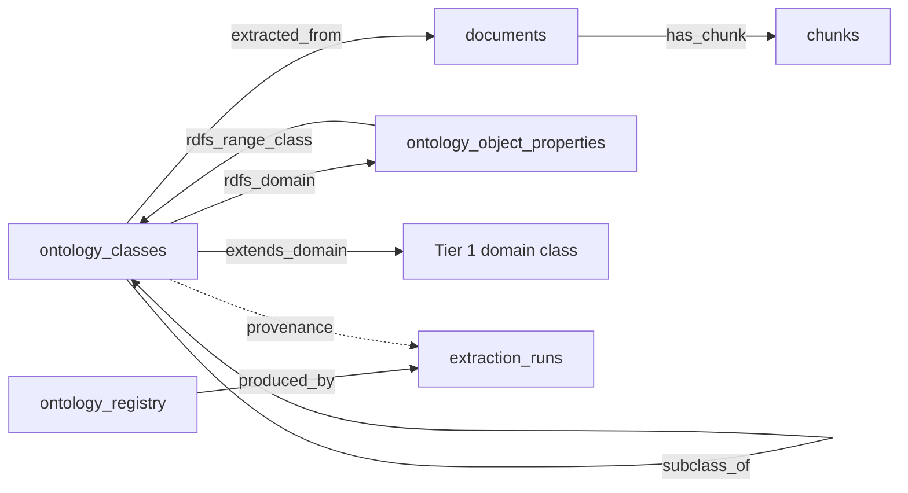

*Figure 5 — The materialized process + ontology graph. Class → property → class traversal, subclass hierarchy, cross-tier extension, and full lineage back to source documents are all native edges.*


*Screenshot — selecting a class opens a read-only detail panel with its quoted evidence text and the exact source chunk/slide it came from.*
<!-- CAPTURE: Left-click a class on the canvas → FloatingDetailPanel. Show label, URI, description, and especially the provenance/evidence section (quoted evidence_text + source chunk ids / slide). -->


So "given a class, which document produced it and which chunks contributed?" is a two-hop AQL query, not a join across systems. That same graph powers the visual canvas, the MCP query tools, and the quality metrics.

---

## 6. Time travel: an ontology has a history

Curated knowledge changes — a class gets renamed, a definition gets refined, a relationship gets retracted. Most systems overwrite. AOE *versions*.

Every versioned node and edge carries a `created` and `expired` timestamp pair; "current" simply means `expired` is set to a far-future sentinel value (`NEVER_EXPIRES`). Editing a class doesn't destroy the old one — it expires that version and creates a new one, and every read quietly filters to "the versions that were live at time T," where T defaults to now. The whole history is therefore queryable by construction, and the workspace exposes a **VCR-style timeline** to scrub through it: play forward, play *backward*, step, or drag to any past moment and watch the graph redraw itself as it stood that day.

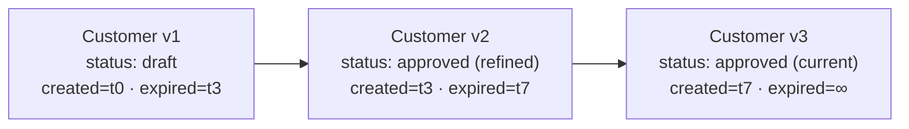

*Figure 6 — Temporal interval versioning. A class is a chain of immutable versions; "now" is the version whose `expired` is the never-expires sentinel. Nothing is ever silently overwritten.*


*Screenshot — the VCR timeline scrubbed back to an earlier event; the canvas re-renders the ontology exactly as it was at that point.*
<!-- CAPTURE: Workspace with an ontology that has history; drag the VCR/timeline slider to a non-latest event and show the canvas reflecting that historical state + the event marker. -->


Time travel isn't a luxury feature here — it's the prerequisite for trusting an *automated* curation system. If an LLM-driven revision goes wrong, you can see exactly what changed, when, and by whom, and revert it.

---

## 7. Belief revision: extraction as an ongoing conversation

Here's where "extract once" breaks down. When you add a second document to an existing ontology, you don't want a fresh, disconnected extraction — you want the new evidence to *update what the ontology already believes*.

AOE treats each existing class, parent link, and relationship as a **belief** with evidence and a confidence score. A new document's extraction is reconciled against those beliefs, and each comparison yields a verdict.

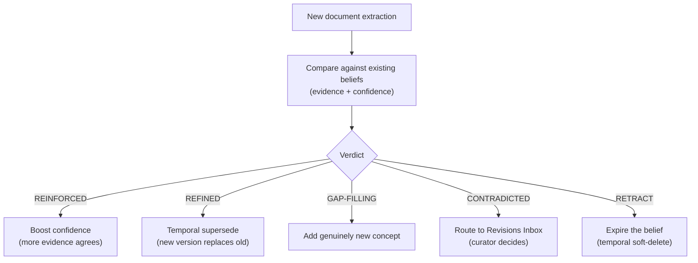

*Figure 7 — Belief revision. Mechanical verdicts handle the easy majority automatically; only genuine contradictions and uncertain cases escalate to a curator's inbox.*


*Screenshot — the Revisions Inbox: a contradiction flagged by a second document, with the agent's justification, awaiting accept / reject / modify.*
<!-- CAPTURE: Open the Revisions Inbox overlay with at least one CONTRADICTED/UNCERTAIN revision; show the detail panel with the revision rationale and accept/reject/modify actions. -->


The split is pragmatic: *mechanical* verdicts — reinforcement, refinement, gap-filling, redundancy — are handled deterministically and cheaply. Only contradictions and uncertain cases invoke an LLM revision agent and surface in the **Revisions Inbox** for a human. Safety guards (published-item protection, a circuit breaker on revision rate, per-org budgets) keep an autonomous reviser from running away — and because everything is temporal, every revision is reversible.

---

## 8. The self-optimizing structural gate

LLM extractions produce a recurring failure mode: a *disconnected* schema. You get dozens of plausible classes, but relationships point at targets that don't quite match any class (a fragment instead of a full URI), and some classes connect to nothing at all.

We borrowed an idea from a self-optimizing-ontology research line: **gate, then repair, before materializing.** A `structural_gate` node sits between belief revision and the curation filter, computing a pre-materialization health report and applying deterministic, 100%-reliable repairs — *no invention*:

- **URI normalization** — re-point a relationship target that matches a known class only by fragment to its canonical URI.
- **Link recovery** — when a relationship's target resolves to no class, re-point it to the class named in the relationship's *own evidence text*.

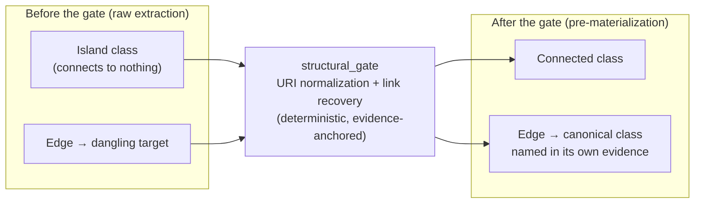

*Figure 8 — The structural gate. Deterministic repairs reconnect the graph before it materializes, without inventing facts the source didn't support.*

The non-negotiable constraint: because the repairs only rewrite relationship *targets* and never touch a class's label, description, or evidence, they **cannot** lower the faithfulness score. That guarantee — proven by a regression test — is exactly what let us turn the gate on by default. The companion post-write metrics (connectivity, structural integrity, isolated-class count, completeness) make the improvement visible in the quality dashboard.

---

## 9. Bootstrapping from a database you already have

Not every ontology should start from documents. If you already run a database — any database — your *schema* is an ontology waiting to be reverse-engineered. Tables (or collections) are already classes; foreign keys (or edges) are already relationships; columns are already attributes. Nobody wrote that down as a formal model, but the model is *there*, and unlike an LLM's reading of a PDF, it's exactly right, because it's the structure the business actually runs on.

So AOE can connect to a live database and walk it, emitting OWL directly — no LLM in the loop, and therefore nothing to hallucinate. The diagram below shows the ArangoDB path (walking its *named graphs* — the declared bundles of collections introduced in §3 — plus any collections not in one); the relational path is the same shape and is covered just below.

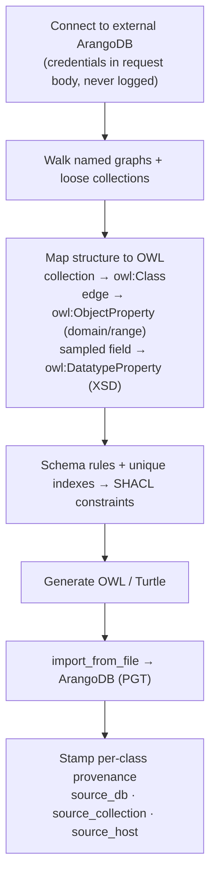

*Figure 9 — Schema extraction from ArangoDB. A named-graph-aware walk produces classes, domain/range-resolved object properties, datatype properties from sampled fields, and SHACL constraints from validation rules and unique indexes — with full provenance back to the source collection.*


*Screenshot — the "Extract from ArangoDB…" overlay: pick which named graphs and collections to include and see the class/property count the extraction will produce, before committing.*
<!-- CAPTURE: Workspace canvas right-click → "Extract from ArangoDB…" → preview step. Show discovered graphs/loose collections with checkboxes and the live "N classes / M object properties" summary line. Redact host/credentials. -->


Two extensions are already in place. First, the same pattern now covers **relational databases** as a first-class source: tables become classes, foreign keys object properties, columns datatype properties, and constraints SHACL — a deterministic SQL→OWL/SHACL mapping AOE owns outright (the `relational-schema-analyzer` library is only a read-only physical-schema introspector), exposed over both REST and MCP. Second, the ArangoDB walk handles **labeled property graphs** — the "single `Node` collection + single `relations` edge collection" shape (common in graph-database and Neo4j exports) where entity and relationship *types* live in a discriminator field rather than in collection names. AOE detects that shape, reads every distinct type value via a full-scan aggregation (not a sample), resolves each relationship's domain/range from the endpoints, and lets you pick the label format — turning one physical `Node` table into the dozens of real classes it actually encodes.

Still on the roadmap: an **optional LLM enrichment layer** *on top of* the deterministic extractor (never replacing it), adding human-readable class descriptions and a Markdown "domain description" of the schema — so the structure stays trustworthy while the prose gets richer.

---

## 10. Reconciling many sources into one master

The two-tier library composes knowledge *vertically* — local ontologies extend shared ones. But organizations also accumulate several ontologies of the *same* domain, built independently from different documents and databases, that need reconciling *horizontally*. Merging them by hand is exactly the tedious, error-prone work ontology engineers dread.

AOE aligns N source ontologies into a single governed **master**. The design principle mirrors the extraction pipeline: spend LLM tokens only where they change the answer, and never let the model's confidence go unchecked.

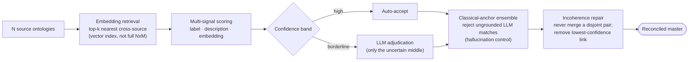

*Figure 10 — Multi-source alignment. Embedding retrieval narrows the candidate set, an LLM adjudicates only borderline pairs, a classical-anchor ensemble catches hallucinated correspondences, and incoherent merges are minimally repaired — every removal reported, the whole master reversible.*


*Screenshot — the alignment review overlay: candidate correspondences ranked for review, with hallucination / disagreement badges and the coherence-repair removals surfaced where curators actually decide.*
<!-- CAPTURE: Right-click an ontology row → "Align Ontologies…" → AlignmentReviewOverlay with a session that has candidates. Show the confidence-ranked list, at least one hallucination/disagreement badge, and (post-materialize) the repair-removals block. -->

Four ideas do the heavy lifting. **Embedding retrieval** (FR-17.2) fetches each class's top-k nearest cross-source neighbours from the entity vector index instead of scoring the full cross-source product — the difference between tractable and hopeless on large sources; entities without an embedding fall back to the full product so recall never silently regresses. **Selective adjudication** auto-accepts the confident band and reserves the LLM for the uncertain middle. The **classical-anchor ensemble** (FR-17.9/17.10) refuses to auto-accept any LLM correspondence that lacks a grounded lexical or structural anchor, and prioritizes LLM-vs-classical disagreements for review — hallucination control, not blind trust. And **incoherence repair** (FR-17.5) detects clusters that would merge a declared `owl:disjointWith` pair and removes the single lowest-confidence correspondence on the connecting path until the master is coherent — reporting every removal. A **DualLoop** active-learning signal re-ranks the review queue so each accept/reject surfaces the next most informative pair, and a source edit triggers a *scoped* re-align of just the affected subset rather than the whole product.

---

## 11. Beyond the schema: the assertion graph

Everything so far builds the **T-box** — the schema: classes, properties, hierarchies, constraints. But a knowledge graph you can actually query needs the **A-box** too: the concrete **individuals** (instances) and the relationships asserted between them. "Acme Corp" *is a* Company; "Acme" *employs* "Bob."

AOE optionally extracts the A-box from the same document chunks, grounded in the T-box it just built.

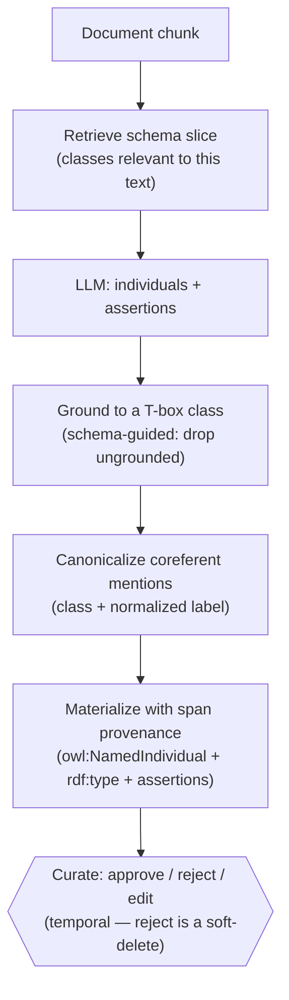

*Figure 11 — A-box extraction. Individuals are typed against the existing schema (ungrounded mentions dropped), coreferent mentions canonicalized, every fact stamped with its source char-span, and each individual curatable over the same temporal layer as the schema.*


*Screenshot — the instance lens (A-box): extracted individuals, each with its `rdf:type` class and how many source spans grounded it, plus per-row approve / edit / reject curation.*
<!-- CAPTURE: Open the Instances (A-box) overlay for an ontology that has individuals. Show rows with type badges + the 📎 span count, and hover a row to reveal the approve/edit/reject actions. -->

The same principles that make the T-box trustworthy carry over. Extraction is **schema-guided** — an individual whose type isn't a class in the retrieved slice is dropped rather than invented. Coreferent mentions across chunks are **canonicalized** by (class, normalized label), so "Acme" and "Acme Corp" become one individual, not two. Every individual and every assertion carries **char-span provenance** back to the exact sentence it came from. Validation flags ungrounded individuals, dangling types, and cardinality violations; grounding and merge metrics quantify how much of the A-box is actually anchored. And curation is **temporal** like everything else: rejecting an individual is a soft-delete — it leaves the live graph but stays queryable as-of a past time — and the A-box exports alongside the T-box as `owl:NamedIndividual` declarations with their types and assertions.

Individuals now also render **on the canvas**, drawn beside the classes that type them, so you can see the schema and the facts that populate it in one picture. That sounds trivial and isn't: a schema has dozens of classes, but an A-box can have hundreds of thousands of individuals, and naively drawing them turns a legible diagram into a hairball and a fast page into a slow one. So instances are **opt-in and expanded one class at a time** — you ask to see the individuals of `Company`, not of everything — and they're served by a separate read path, leaving the latency-sensitive schema projection untouched. (One small correctness detail worth the mention: individual node IDs are namespaced `ind:<key>` on the way to the canvas, because an individual and a class could otherwise share an identifier and one would silently overwrite the other — a class of bug that produces no error, just a missing node.)

---

## 12. Extraction driven by the questions it must answer

An ontology isn't built for its own sake — it exists to answer questions. AOE makes those **competency questions (CQs)** first-class, and then uses them to *shape* everything else.

A curator authors use cases and their CQs directly, or an LLM proposes candidates from the ontology's purpose statement and existing class labels (NeOn-GPT-style). The crucial guard: because automated CQs are unreliable, **every suggestion is `proposed` until a human accepts it** — nothing is auto-persisted — and a deterministic **VSPO-style pitfall lint** flags malformed questions before they waste anyone's time (not phrased as a question, compound "and/or" clauses, yes/no binaries, no domain term to ground).

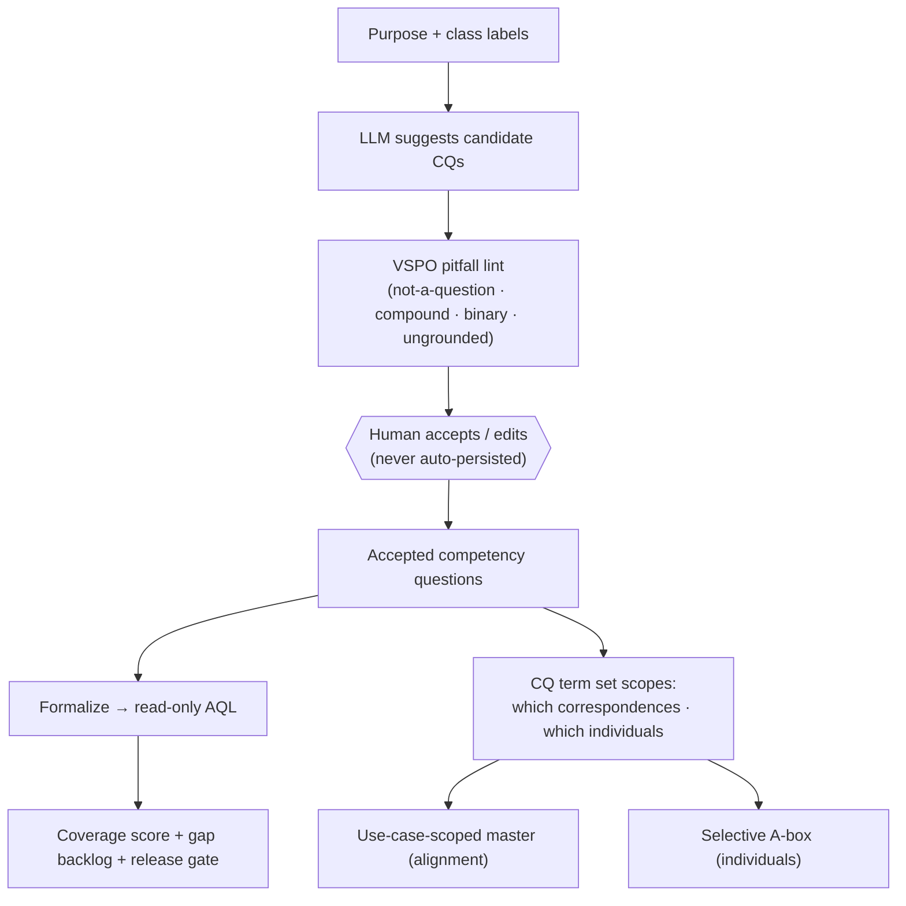

*Figure 12 — Requirements-driven extraction. CQs are human-accepted (LLM-assisted, pitfall-linted), formalized to AQL, and scored for coverage — then the CQ term set scopes which cross-source correspondences and which individuals actually matter.*


*Screenshot — the Requirements overlay: authored use cases + CQs, an LLM "Suggest CQs" panel with per-suggestion pitfall badges, and the coverage report.*
<!-- CAPTURE: Open the Requirements & coverage overlay. Show authored CQs, click "✨ Suggest CQs" to reveal suggestions with pitfall badges (accept/dismiss), and the coverage report + gaps below. -->

The payoff closes the loop with the two capabilities above. The **CQ term set** — the entities and relationships the questions reference — is used to *scope* the rest (FR-19.9): it narrows which cross-source correspondences matter, producing a **use-case-scoped master** instead of aligning everything, and it selects which individuals to keep, producing a **selective A-box** instead of materializing every mention. The questions the ontology must answer literally shape the graph that gets built — a use-case-shaped knowledge graph, not an everything-graph.

---

## 13. What a thing is *called* is a domain judgement

Those same competency questions turned up something we didn't expect, and it's the most useful result in this article.

Here's the setup. Two different classes in the catalog each have an attribute labelled `role`. On `Document`, it means the document's kind — *contract*, *invoice*, *QBR deck*. On `Contact`, it means the person's job — *champion*, *exec sponsor*. A machine can detect that collision trivially: same label, two different concepts. What a machine *cannot* do is resolve it, because the right answer isn't a renaming rule — it's a domain judgement. And frequently the right answer is **neither existing name**: `Contact.role` reads far better as **job title**, which no algorithm was ever going to propose.

We only noticed because we were measuring. Running a 71-question natural-language benchmark against the catalog, we tried four increasingly clever algorithmic fixes in the consuming translator — better candidate ranking, smarter join assembly, embedding-based concept resolution, clause pruning. Two of them moved the score *not at all*.

Then we renamed six labels by hand.

| | Before | After |
|---|---|---|
| Overall accuracy (71 questions) | 60% | **69%** |
| Questions spanning three sources | 15% | **25%** |

Identical across five runs. Six human judgements about *what things are called* beat four rounds of algorithm work — and the honest caveat belongs right here: only 8 of the 71 questions span three sources, so "15% → 25%" is two additional questions. Small sample. But the direction of the finding is the actionable part, and it's not "build a cleverer translator." It's **make curation cheap**, because a human resolving a name is worth more than another retrieval heuristic.

So AOE grew a **curated lexicon**.

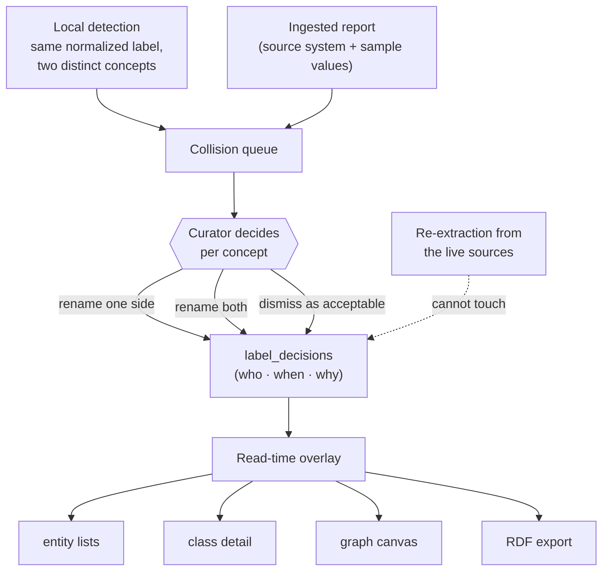

*Figure 13 — The curated lexicon. Collisions arrive from two producers, a curator resolves them per concept, and the decision is stored in its own place — merged over the extracted label on every read path, and structurally out of reach of the next extraction.*

Three design choices carry the weight:

**A resolution is a decision, not an edit.** Renaming only one side of a collision is often the correct outcome, so partial resolution is first-class. Re-deciding *expires* the previous decision rather than overwriting it, which means the trail stays queryable — and in this feature the audit trail is as much of the value as the string. Six months later, "why is this called job title?" has an answer with a name and a date on it.

**The decision is merged in at read time.** Curated labels live in their own store, joined to concepts by URI, and are overlaid on the extracted label wherever a label is displayed or exported — entity lists, the detail panel, the canvas, RDF export. Any read path that skips the overlay serves a stale, pre-curation name; that's a hard rule, not a nicety.

**And the decision has to survive the next extraction.** Which brings us to the bug.

### The trap this had to be designed around

The obvious implementation is to write the curated label onto the concept. Rename `Contact.role` to *job title*, save. Done.

That implementation is quietly broken, and the reason is a collision between two mechanisms that are each individually reasonable.

Extraction rebuilds a concept's database key *from the LLM's label* and re-inserts with `overwrite=True` — replace whatever is already at that key. Meanwhile, a curator edit goes through the temporal layer: it expires the original row and writes a new row under a fresh key. Nothing wrong with either half.

Now refresh the catalog from live sources. Extraction reclaims the key it used last time — the key of the *expired* row — and `overwrite=True` replaces that document wholesale, including its `expired` timestamp. The retired version comes back to life.

The result isn't that your curated label reverts. It's worse and much harder to spot: you get **two live rows for one attribute** — the curated *job title* and a resurrected *role* — and nothing anywhere reports an error.

We argued this out from reading the code, and then, because reading code is not evidence, wrote an integration test against a real ArangoDB 3.12 container to settle it. It confirmed all of it: one live row after the curator edit under a new key; **two** live rows after a single re-extraction; and — the reassuring half — the read-time overlay collapses both back to the curated label, because they share a URI. A decision survives two consecutive re-extractions untouched.

That test could not have been a unit test. The whole failure mode lives in how one database's `overwrite=True` replace semantics interact with a sentinel timestamp — precisely the thing a mock is happy to lie to you about.

It also killed the obvious mitigation. A "locked" flag on the concept, checked at write time? `overwrite=True` replaces the entire document, lock included.

So the architecture follows from the failure: **store the decision where extraction never writes.** Survival stops being a convention that every future write path has to remember, and becomes structural — the property holds because of where the data lives, not because everyone stayed disciplined. (Wiring the overlay into export surfaced one more trap on the way: A-box assertions resolve their predicate by *label* lookup, so a renamed property would have matched no assertions at all and quietly minted a parallel predicate. The lookup index is now built from curated **and** pre-curation labels.)

There's a general lesson buried in this one, and it's the reason it's in this article. A curated label that a refresh silently discards is **worse than no curation at all** — the human's work disappears, the metric quietly regresses, and nobody is told. Any system that mixes automated regeneration with human judgement has to answer one question explicitly: *what happens to the human's decision the next time the machine runs?* Get that wrong and every other guarantee in the product is decoration.

---

## 14. The workspace: one stage, not a maze of pages

A tool that produces graphs is only as good as the surface you curate them on. AOE deliberately rejects the "wizard with twelve pages" pattern. The entire experience is **one persistent stage** built around objects, with a single interaction contract.

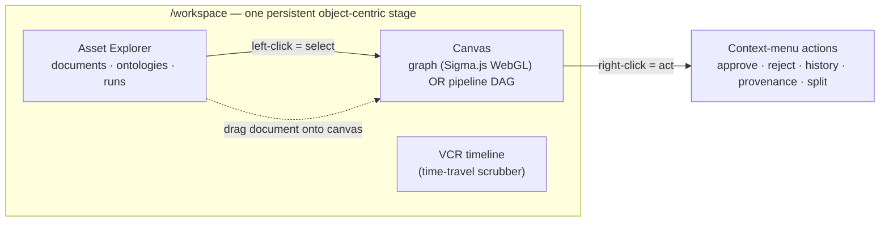

*Figure 14 — The object-centric workspace. Left-click selects and opens a read-only detail panel; right-click acts; drag-and-drop initiates extraction or composition. Swapping what the canvas shows is an object swap, not navigation.*


*Screenshot — the interaction contract in action: right-clicking a class surfaces its actions (approve/reject, view history, provenance, delete) — no separate page required.*
<!-- CAPTURE: Right-click a class node on the canvas to open its context menu; show the action list. Optionally show the lens legend (bottom-left) in the same frame. -->


The rules are strict on purpose: **left-click selects, right-click acts**, and read-only selection is always safe (no "click to delete"). Destructive actions never use native browser dialogs — reversible ones act immediately with an undo toast, irreversible ones use a typed-confirmation overlay. The canvas renders whatever matches the selected object — pick an ontology, you get the graph; pick a run, the pipeline DAG — with no global "edit mode." The canvas is GPU-rendered in the browser (WebGL, via Sigma.js and graphology) so a few thousand nodes pan and zoom smoothly instead of freezing the tab, and **lenses** — colour-by-confidence, colour-by-source, show-instances — repaint attributes onto a *stable* layout rather than re-running it, so changing your view never rearranges the picture under you.

Everything in the article shows up here, because there is nowhere else for it to show up: the timeline scrubs history, the instance lens overlays the A-box on the schema, the lexicon queue is where colliding names get resolved, and structural editing — renaming a class, or reparenting one subtree onto another — happens as a single atomic operation on the graph rather than a delete-then-recreate that would break every edge pointing at it.

---

## 15. Trust, measured: quality metrics

Because the system is automated, it has to be *legible*. AOE scores every extraction along multiple signals and rolls them into an ontology health score (0–100) with a traffic-light display:

- **Faithfulness** — does each class trace to real evidence? (LLM-as-judge.)
- **Semantic validity** — are the assertions internally coherent?
- **Connectivity** and **structural integrity** — is the graph actually a graph, or a bag of islands?
- **Completeness** — how much of the declared structure survived to materialization?
- **Confidence** — a multi-signal score combining evidence age, count, and judge scores.

These aren't vanity numbers. The connectivity and structural-integrity metrics are exactly what the structural gate moves, and faithfulness is the hard cap that any automated repair or revision is forbidden to regress.


*Screenshot — the per-ontology quality view: a six-dimension radar plus the 0–100 health score with a traffic-light indicator.*
<!-- CAPTURE: /workspace or /dashboard per-ontology Quality tab: the recharts radar (faithfulness, semantic validity, connectivity, structural integrity, completeness, confidence) + the health-score card. -->


---

## 16. When one document spans many domains: domain detection

Real documents — a strategy deck, a regulatory filing — often span *several* domains at once, and a single topic can run across many slides, yet today's pipeline assumes one ontology per run. The roadmap adds **domain detection**: a pre-extraction step that clusters chunks by topic and routes them.

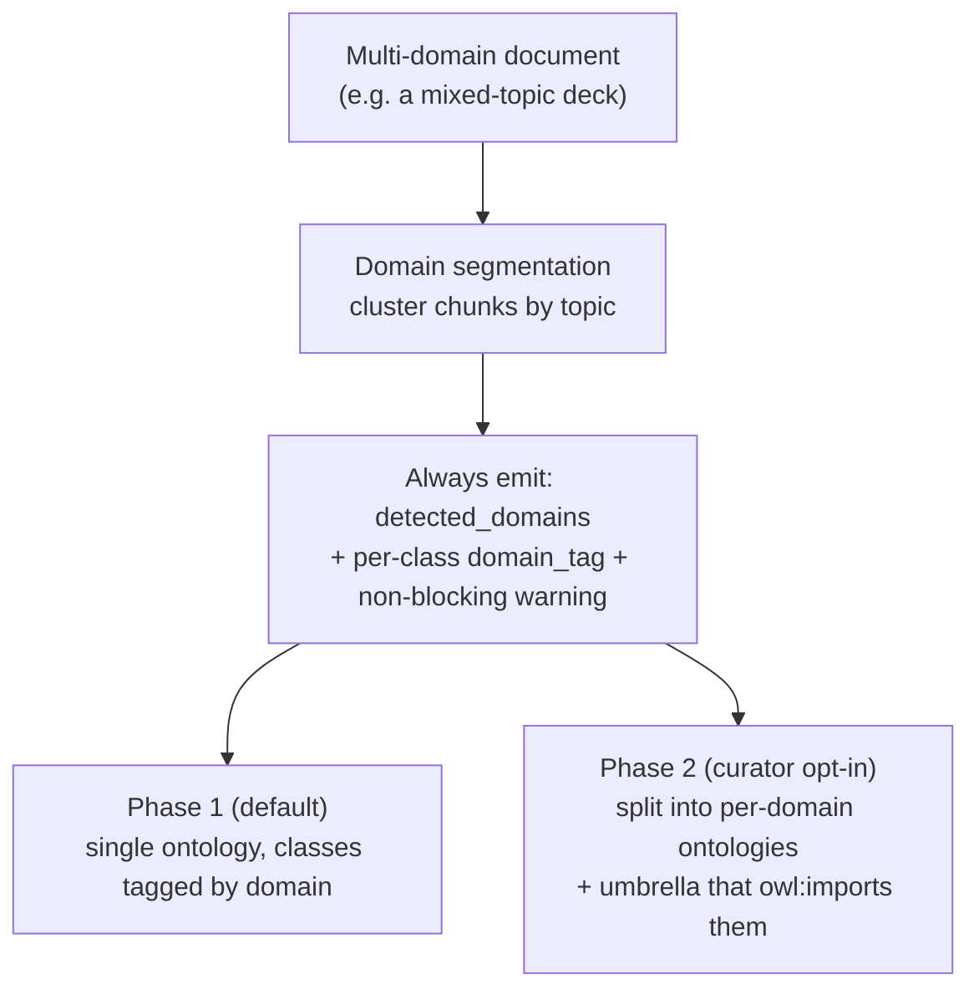

*Figure 15 — Domain detection roadmap. Detection is shared infrastructure; the default keeps everything in one tagged ontology, while a curator can opt into splitting into clean, reusable per-domain ontologies under an umbrella — reusing the imports machinery that already exists.*

Paired with it is **structure-aware chunking**: slide boundaries never merged, speaker notes kept distinct, and cross-slide topics grouped into one "topic unit" so the extractor reasons over coherent chunks, not arbitrary token windows. Domain splitting and slide grouping are the *same capability at two scales* — segmenting a document into coherent units.

---

## 17. Governing the release: agents that critique before publish

Curation during extraction is one gate. The other — building out next — is the **release** boundary. Ontologies that downstream systems import via `owl:imports` or query over MCP need stable, governed versions, and hand-inspecting every concept before each release doesn't scale. So it gets its own agentic review.

When an engineer cuts a release candidate, a **Release Readiness Review** *composes signals AOE already computes* — rule-engine violations (cycles, disjointness, cardinality conflicts), the six quality metrics, gold-standard recall, the breaking-change report — and an LLM critic ranks them as `blocking`, `warning`, or `info`, each with evidence and, where the fix is deterministic, a one-click repair routed through the structural gate.

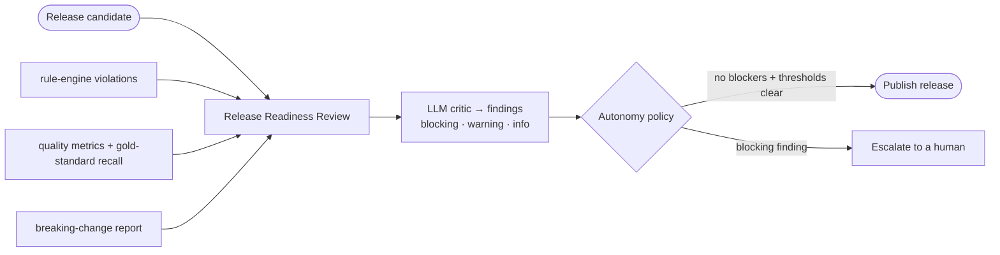

*Figure 16 — Release governance. Deterministic signals plus an LLM critic produce a findings report; a configurable autonomy policy decides whether a clean candidate auto-publishes or escalates to a person.*

The point is that **autonomy is a dial, not a default**:

- **Advisory** — the report informs a human, who publishes. (Default.)
- **Gated-autonomous** — auto-publish only when there are zero blocking findings *and* the metrics clear configured thresholds; otherwise escalate.
- **Supervised-autonomous** — auto-publish and notify, report attached for audit.

Two invariants keep the higher settings honest: **faithfulness is a floor the review can never waive**, and **every release is reversible**. That's the shift from human-*in*-the-loop (a person must touch every item) to human-*on*-the-loop (people set policy and handle the exceptions) — the same move that let CI/CD scale for code.

---

## 18. Closing: ontologies as living systems

The thread running through Arango-OntoExtract is a rejection of the "extract once" mental model. An ontology in AOE is:

- **Proposed** by LLM agents, but **disposed** by humans at an explicit breakpoint.
- **Grounded** in evidence that traces back to specific document chunks or database collections.
- **Versioned** in time, so every change is auditable and reversible.
- **Revised** as new evidence arrives, instead of re-extracted from scratch.
- **Self-repairing** in deterministic, faithfulness-preserving ways before a human ever sees it.
- **Composed** across a shared two-tier library instead of duplicated.
- **Reconciled** across many independent sources into one coherent, hallucination-controlled master.
- **Populated** with grounded individuals (the A-box), not just a schema.
- **Requirements-driven** — the competency questions it must answer scope what gets aligned and kept.
- **Named** by people, in decisions that outlive the next extraction rather than being overwritten by it.

One multi-model database is what makes that economical: the provenance chain, the embeddings, and the graph traversals all live in the same engine. The LLMs do the heavy lifting of *proposing* structure; the architecture does the heavier lifting of making it *trustworthy enough to keep*.

And the measurement worth leaving you with is the one that shaped the product. We benchmarked the algorithmic route against the human one — and six curated decisions beat it. The scarce resource in this kind of system isn't model capability — it's human judgement, and the engineering that decides whether that judgement is captured cheaply and then *kept*.

That's the bet: the future of ontology engineering isn't a better one-shot extractor. It's a living system that proposes, grounds, versions, and revises — with a human holding the pen.

Much of that thread is already woven in: relational databases and labeled property graphs are first-class sources alongside prose; multi-source alignment reconciles independently-built ontologies into a governed master; the A-box populates the schema with grounded facts; and competency questions shape what gets built. Where we take it next follows the same line: domain-aware segmentation that fans a mixed document out into clean, reusable per-domain ontologies, and a release-governance dial that turns up as the signals prove themselves — more candidates auto-publishing on policy, fewer waiting on a person. The faithfulness floor and reversibility never move. The destination is the same: not less human judgment, but human judgment spent where it moves the needle.

---

## Try it

Arango-OntoExtract is open source under the MIT licence:

### 👉 **[github.com/arango-solutions/arango-ontoextract](https://github.com/arango-solutions/arango-ontoextract)**

It's a web application, not a CLI. You'll need Docker, Python 3.11+, Node 18+, and two API keys (one LLM, one for embeddings):

```bash
git clone https://github.com/arango-solutions/arango-ontoextract
cd arango-ontoextract
cp .env.example .env      # set ANTHROPIC_API_KEY + OPENAI_API_KEY

make setup                # Python venv + npm deps
make infra                # ArangoDB + Redis in Docker — no manual DB install
make migrate              # collections, indexes, graphs
make doctor               # preflight: verifies your keys, models and DB are live
make backend              # leave running

# second terminal
make frontend
```

Then open **http://localhost:3000** — that's the workspace: upload, extract, curate, scrub the timeline.

**Three things worth doing first**, roughly in increasing order of "huh, that's interesting":

1. **Point it at a database you already run.** No LLM, no keys needed for this path, and no hallucination risk — it's a deterministic walk of a live schema. It's the fastest way to a defensible first ontology, and it takes about a minute.
2. **Upload a slide deck, then upload a second one on the same subject.** The second extraction won't start over; watch the belief-revision verdicts land, and see which contradictions get routed to the inbox instead of being silently resolved.
3. **Curate something, then re-extract.** Rename a class, then run extraction again over the same source. That's the mechanism §13 is about, and watching a decision survive a regeneration is more convincing than reading about it.

If you find something broken or want a capability that isn't there, issues and PRs are welcome — the [PRD](https://github.com/arango-solutions/arango-ontoextract/blob/main/PRD.md) is in the repo and is the actual source of truth for what the system is supposed to do, so it's an unusually easy codebase to propose against.

---

*Want to go deeper? The companion pieces could cover (a) the temporal data model and how `NEVER_EXPIRES` interval semantics power time travel, (b) the LLM-as-judge faithfulness rater and the multi-signal confidence model, or (c) how MCP turns the whole platform into a set of tools any AI agent can call.*
